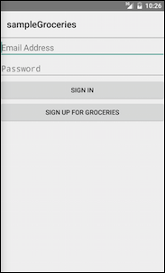

在开始“杂货铺”app编程之前，理解 NativeScript app 的文件夹结构是比较重要的。这有助于你了解在哪里放置新文件，又能理解一些在 NativeScript 内部将要发生事情。

那就用你的文本编辑器打开你的app文件夹 `sample-Groceries` ，我们继续深入。

## [**本节内容**](http://docs.nativescript.org/tutorial/chapter-2#table-of-contents)

* [2.1: Directory structure 目录结构](#21-目录结构)
* [2.2: Adding UI components 添加UI组件](#2-2)
* [2.3: Layouts 布局](#2-3)
* [2.4: CSS ](#2-4)
* [2.5: Images 图片](#2-5)

## **[2.1: 目录结构](http://docs.nativescript.org/tutorial/chapter-2#21-directory-structure)**

为了便于理解，我们先看杂货铺app的外层结构：

> . 
> └── sample-Groceries 
>    ├── app 
>    │ └── ... 
>    ├── node\_modules 
>    │ └── tns-core-modules 
>    ├── package.json 
>    └── platforms 
>        ├── android 
>        └── ios

这些文件和文件夹的作用如下：

* **app**: 这个文件夹包含你制作app的所有需要的开发资源。在这里面你会花掉你大多数编写时间。
* **node\_modules**: 这个文件夹包含你app的npm模块依赖。所有新的 NativeScript 项目都从一个单独的模块—— tns-core-modules 。
* **node\_modules\/tns-core-modules**: 这个文件夹包含你app的 NativeScript 模块，是一系列你要用于制作app的由NativeScript 提供的 JavaScript 模块。每个模块都包含特定平台实现一些功能 的代码——相机，http请求，文件系统，等等——通过暴露一个平台无关的API \(比如`camera.takePicture()`\) 。我们一会就会看到一些例子。
* **package.json**: 这个文件包含你app的详细设置，比如ID，你使用的 NativeScript 版本，以及app使用的npm模块。 我们会在 [chapter 5](http://docs.nativescript.org/tutorial/chapter5). 讲到使用npm模块的时候详细看看如何使用这个文件。
* **platforms**: 这个文件夹包含 NativeScript 用于搭建原生ios和安卓应用必须的特定平台代码。比如在 `android` 文件夹里你会发现类似项目的 `AndroidManifest.xml` 和 .apk 执行文件。同样， `ios` 文件夹包含杂货店的 Xcode 项目和 .ipa 可执行文件。注意，使用Windows的用户电脑不会有 `ios 文件夹。`

当你开发和运行app时NativeScript CLI为你管理`platforms`文件夹；因此，最好的做法是把 `platforms`文件夹作为生成的代码。杂货铺app包含 `platforms`文件夹 并在 `.gitignore` 文件里从源码管理排除它。

接下来我们深入了解app文件夹，因为你会在里面花掉你大部分时间：

> . └── sample-Groceries 
>    ├── app
>    │   ├── App\_Resources 
>    │   │     ├── Android 
>    │   │     └── iOS 
>    │   ├── shared 
>    │   │     └── ... 
>    │   ├── views 
>    │   │     └── login 
>    │   │         ├── login.js 
>    │   │         └── login.xml 
>    │   ├── app.css 
>    │   ├── app.js 
>    │   └── ... 
>    └── ...

这些文件和文件夹的作用如下：

* **App\_Resources**:这个文件夹包含特定平台的资源，比如图标，splash screens，配置文件等。 当你运行 `tns run时，`NativeScript CLI 把 这些资源 小心注入到 `platforms` 文件夹里合适的位置。

* **shared**: 这个文件夹，特定于杂货店app，包含那些在你app里需要跨视图共享的任意文件，你可以找到一些 view model 对象和用于共享配置变量（如 API keys ）的 `config.js` 文件。

* **views**: 这个文件夹包含创建你app视图的代码，每个视图在 `views` 里都有一个文件夹。每个视图由一个 XML 文件，一个 JavaScript 文件，和一个可选的 CSS 文件组成。杂货店app包含三个视图所以有三个文件夹。

* **app.css**: 这个文件包含了你app的全局样式。我们会在 [chapter 2.4](http://docs.nativescript.org/tutorial/chapter-2#24-css). 里详细探讨。

* **app.js**:这个文件设置你应用的启动模块和初始化app。

## **[2.2: Adding UI components](http://docs.nativescript.org/tutorial/chapter-2#22-adding-ui-components)** 添加组件 {#2-2}

我们深入到创建appUI的文件，它们位于 `app/views` 文件夹。每个 `app/views` 里的文件夹都包含杂货店三个页面之一的代码： `list`, `login`, 和`register` 。如果你打开 `app/views/login` 文件夹，会看到我们上一章更新的三个文件： `login.css`, `login.js`, 和`login.xml` 。再次打开 `login.xml` 你会看到下面的代码：

> `<Page>
> <Label text="hello NativeScript" />
> </Page>`

这个页面目前包含两个UI组件：一个`<Page>` 和一个 `<Label>` 。为了让这个页面看起来更像登录页面，我们来增加一些另外的组件，两个 `<TextField>` 元素和两个 `Button` 元素。

#### **操作: ** 向`login.xml` **添加 UI 组件**

打开 app/views/login/login.xml 文件并用下面的代码替换现有的`<Label>`：

`<TextField hint="Email Address" keyboardType="email" autocorrect="false" autocapitalizationType="none" /> `
`<TextField hint="Password" secure="true" /> `
`<Button text="Sign in" /> `
`<Button text="Sign up for Groceries" />` 

NativeScript UI组件提供一些属性让你设置其行为和表现。你刚才添加的代码使用了下面的属性：

* `<TextField>`

  * `hint`: 显示占位字符用来告诉用户输入什么。
  * `keyboardType`: 用户目前输入时的键盘类型。`keyboardType="email"` 显示优化的用于输入邮件地址的键盘。 NativeScript 现在支持  五种类型的[ keyboards](http://docs.nativescript.org/ui/keyboard.html) 。
  * `autocorrect`: 一个布尔属性，用于判断系统是否自动更正用户的输入。如果是邮件地址输入框，自动更正的行为是不太受欢迎的。（应该是自动更正英文的吧？）
  * `autocapitalizationType`:  决定系统如何让用户的输入大小写适配。  `autocapitalizationType="none"` 关闭所有的大小写适配。 NativeScript 支持 四种文本域的[ autocapitalization类型。](http://docs.nativescript.org/api-reference/modules/_ui_enums_.autocapitalizationtype.html)
  * `secure`:该布尔属性决定是否掩盖文本框的文字，这通常在 password 栏使用。

* `<Button>`

  * `text`: 控制 button 内嵌现实的文字。

在更改后再次启动app，你会看到一个孤独的 `<Button>` 组件出现在屏幕上：

目前你只看到一个单独的按钮是因为你还没有告诉 NativeScript 如何布局你页面的UI组件。我们来看下如何使用 NativeScript 的**布局**来安排屏幕上的这些组件：

> ### 提示：
> 
> NativeScript文档包含了你用于zhizuoapp的[完整的UI组件和属性](http://docs.nativescript.org/ui/basics)。你甚至可以[创建自己的UI组件](http://docs.nativescript.org/ui/basics#custom-components)。

## **[2.3: Layouts ](http://docs.nativescript.org/tutorial/chapter-2#23-layouts)**布局 {#2-3}

NativeScript提供几个不同的布局容器，允许你在你想要的位置精确地放置你的UI组件。

* [Absolute Layout](http://docs.nativescript.org/cookbook/ui/layouts/absolute-layout) 允许你用X-Y坐标放置元素。这个在你要把元素放到特别的位置时很有用，比如要在app的左上角显示一个 activity indicator widget （动态指示小挂件）。
* [Dock Layout](http://docs.nativescript.org/cookbook/ui/layouts/dock-layout) 用于放置UI元素到外层边框。例如，一个停靠在屏幕底部的容器会是显示广告的好位置。
* [Grid Layout](http://docs.nativescript.org/cookbook/ui/layouts/grid-layout) 让你把你的界面分割成若干行和列，比较类似HTML里 `<table>` 干的事情。
* [Stack Layout](http://docs.nativescript.org/cookbook/ui/layouts/stack-layout) 让你横向或纵向堆码UI子组件。
* The [Wrap Layout](http://docs.nativescript.org/cookbook/ui/layouts/wrap-layout) 当一行或列填满时子组件顺应到下一行或列。

对于你的login页面，你需要的就是一个简单的 `<StackLayout>` 来从上到下堆码所有的UI组件。在后面的部分，你会使用一些更高级的布局。

### 操作：添加一个 **stack layout** 到login页面

在 `login.xml里，添加一个<StackLayout>组件`到`<Page>组件里面。` `login.xml` 看起来会是这样了：

> `<Page>`
> 
> `<StackLayout orientation="vertical">`
> 
> `<TextField hint="Email Address" keyboardType="email" autocorrect="false" autocapitalizationType="none" />`
> 
> `<TextField hint="Password" secure="true" />`
> 
> `<Button text="Sign in" />`
> 
> `<Button text="Sign up for Groceries" />`
> 
> `</StackLayout>`
> 
> `</Page>`

stack layout 是个UI 组件，因此，它同你在之前部分用到的 `<TextField>` 和`<Button>` 组件一样具有属性。这里， `orientation="vertical"` 属性告诉 stack layout 垂直安排子组件。

改动之后运行app ，你会看到 login 页面的UI组件垂直排列了：

既然UI组件有了正确的排列顺序，它们就可以用一些颜色和空间来让app好看一点了。为此我们来看 NativeScript 的另一个特质：CSS。

### **提示：**

* 参考 NativeScript 官方文档了解更详尽的 [NativeScript layouts](http://docs.nativescript.org/layouts)  和你可以对它们的各种操作。
* 看看Jen Looper's 在[demystifying NativeScript layouts](https://www.nativescript.org/blog/demystifying-nativescript-layouts) 的文章f深入了解NativeScript layouts in action.的运用。

## **[2.4: CSS](http://docs.nativescript.org/tutorial/chapter-2#24-css)** {#2-4}

NativeScript使用了CSS的一个子集来改变你app的视觉效果。你可以用三种机制为UI组件添加CSS属性： 应用通用的[ CSS](http://docs.nativescript.org/styling#application-wide-css) \(`app.css`\), 特定页面的[ CSS](http://docs.nativescript.org/styling#page-specific-css), 和内嵌的`style` 属性。

### **提示：**

* `在app.css` 里添加CSS规则会对所有页面生效，特定的CSS文件 \(比如`login.css`\)的CSS规则只会对单一页面生效。

* 虽然内嵌style便于快速测试——比如 `<Page style="background-color: green;">` ，你一般不要这样干，因为 style 属性会让xml文件代码凌乱，尤其你在需要生命复杂样式时。

我们从添加一些 应用通用的 CSS 规则 \(`app.css`\),开始。

### 操作：创建全局样式

复制以下代码到 `app.css` 文件：

`Page { background-color: white; font-size: 17; }`

`TextField { margin: 10; padding: 10; }`

`Image { margin-top: 20; margin-left: 0; margin-right: 0; margin-bottom: 80; }`

`Button { margin: 10; padding: 10; }`

如果你此前做过一些web开发，这里的语法一定很熟悉。你通过标签名选定了四类UI组件 \(Page, TextField, Image, 和 Button\) ，然后以 名称—值（键值对）的形式声明了若干CSS规则。 NativeScript不支持所有的CSS属性，因为在原生app里继续沿用其中一些会带来性能问题。官方给出了一份[支持的全部CSS属性的列表。](http://docs.nativescript.org/ui/styling#supported-properties)

我们再来做点改动。虽然你常希望CSS规则对ios和android app一样有效，但偶尔使用的CSS规则只对一个平台有作用。比如，ios的  文本域（ text fields） 往往自带边框，而android的却不会。我们来看下在 NativeScript 里如何实现特定平台的style样式改变。

### 操作：添加特定平台的CSS

将下面的代码添加到`app.css文件第一行：`

`@import { url('~/platform.css') };`

### 注意：

**在@ import语句必须先于所有其他的CSS规则条件下， NativeScript 与浏览器的表现一致。**

接着，在 `login.xml` 里为 sign up按钮添加一个 `class="link"` 属性该按钮的标记应该是这样的：

`<Button text="Sign up for Groceries" class="link" />`

我们分解下刚才发生的情况。首先， NativeScript 支持CSS的 `@import` 语句把一个CSS文件导入另一个。新的这行代码把 `platform.css` 的CSS规则导入到了 `app.css` 。但是，你或许注意到杂货店没有一个名为 `platform.css` 的文件—— 只有`app/platform.android.css` 和 `app/platform.ios.css存在。究竟发生什么事了？`

当你执行 `tns run 或 tns livesync，`NativeScript CLI 从app文件夹取出你的代码放到位于 `platforms/ios` 和 `platforms/android文件夹的`原生工程里。接着是命名转换出马：移动文件的时候， CLI聪明地选择 `.android.*` 和 `.ios.*` 文件。举个例子， CLI 移动`platform.ios.css 到 platforms/ios` 并将其命名为 `platform.css；同样`, CLI 移动 `platform.android.css 到 platforms/android`,，并将其命名为`platform.css。`这个转换提供了一个便捷的方式分发你的代码来单独地处理iOS和Android，它支持 NativeScript 里的所有文件——不只是CSS文件。你之后在本教程里会看到更多的例子。

下面是另一个我们要讨论的改动，就是你在这个按钮上添加的 `class` 属性：

> `<Button text="Sign up for Groceries" class="link" /> `

NativeScript 使用class属性为UI组件添加CSS类名。这个类名用来给 sign up 按钮一个轻微区别于 sign in 按钮的外观。 你可以根据类名在 `platform.ios.css` 和`platform.android.css`里找到相应的CSS规则：

`/* From platform.android.css */`

`.link { background-color: transparent; }`

`/* From platform.ios.css */`

`.link { border-width: 0; }`

提示： NativeScript 也支持以 `id` 属性选择元素。请参考官方文档 [a full list of the supported selectors](http://docs.nativescript.org/styling#supported-selectors).。

有了这些改动，你会发现app看起来也像模像样了，而且在ios和android上看起来有明显不同：

在我们继续之前，花点时间任意地摆弄app的外观。你可以尝试添加一些另外的CSS类名，或者在你的 `login.css` 文件里添加特定页面的样式。如果你弄完了，我们接下来向登录页面添加一张图片。

## **[2.5: Images](http://docs.nativescript.org/tutorial/chapter-2#25-images)**图片 {#2-5}

在 NativeScript 里，你用 `<Image>` UI组件和它的 `src` 属性向页面添加图片。 `src` 属性 允许你以三种方式指定图片。第一种方式是指向一个图片的 URL 地址：

`<Image src="https://www.nativescript.org/images/default-source/landingpages/logo.png" />`

第二种方式是指向一张位于你app的 `app` 文件夹的图片。比如你有一张图片位于 `app/images/logo.png` ，你可以这样调用它：

`<Image src="~/images/logo.png" />`

第三种方式，也是杂货店采用的，是使用特定平台的图片资源。我们添加一张图片到登录页面再好好讨论发生了什么。

#### **操作：添加一个LOGO**

`login.xml`, 在现有的 `<StackLayout>` 标签下面添加`<Image>` 作为其第一个子组件：

`<Image src="res://logo" stretch="none" horizontalAlignment="center" />`

`这里的 res://`语法告诉 NativeScript 使用一个特定平台的资源，这里是个图片特定平台的资源在你app的 `app/App_Resources` 文件夹。如果你看看这里就会发现一些不同的图片文件， 其中有几个名叫 `logo.png。`

虽然比直接往 `app` 文件夹放张图片复杂些，使用平台特定的图片让你更多地能控制图片在不同尺寸设备上的表现。例如，IOS让你为不同像素密度的设备提供三张不同的图片。由此你在 `App_Resources/iOS` 文件夹会找到命名为 `logo.png`, `logo@2x.png`, 和 `logo@3x.png` 的LOGO图片。对于android，类似的图片位于 `App_Resources/Android/drawable-hdpi` \(高dpi\)， `App_Resources/Android/drawable-mdpi` \(中dpi\)，和`App_Resources/Android/drawable-ldpi` \(低dpi\) 。

一旦这些文件就位，NativeScript 框架知道如何选取正确的文件；需要你做的只是用 `res://` 和基文件名指向图片——例如 `res://logo`  。下面是你的登录界面在IOS和android上的样子：

到这里你的UI看起来不错了，但这个app仍然不能做任何事情。我们来看看你能如何使用 JavaScript 增加一些功能。

### 提示：

> **由社群编写的 **[NativeScript Image Builder](http://nsimage.brosteins.com/)**可以帮你生成IOS和Android的合适分辨率的图片。**

