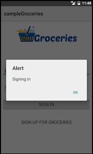
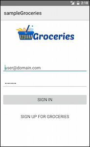

# **[Chapter 3—Application Logic ](http://docs.nativescript.org/tutorial/chapter-3#chapter-3application-logic)**应用逻辑

在这一章中，您将学习如何添加JavaScript逻辑到你的nativescript APP，你会使用构建 NativeScript 框架的基本模式， MVVM ，或是“  **Model**   **View**   **ViewModel** ”。下面是这些词的意思：

* **Model（模型）：**模型定义和表示数据。将模型从各种可能使用的视图中分离出来，就可以实现代码重用。

* **View（视图）：**视图代表UI，在 NativeScript 是写在XML文件里的。视图常与视图模型数据绑定，使得在JavaScript里对视图模型作的改动立即触发UI组件的视觉效果变化。

* **View Model（视图模型）：** 视图模型包含应用逻辑（通常包括模型），并把数据暴露给视图。NativeScript提供一个叫做“ **Observable** ”的模块，这有助于创建一个可以绑定到视图的视图模型对象。

独立划分模型、视图和视图模型的最大好处是，你可以使用双向数据绑定；就是说，模型里面的数据变化会立即影响反应在视图上，反之亦然。另一个好处是代码重用，所以你经常可以跨视图使用模型和视图。

杂货店里，目前你只接触了视图 \(`login.xml`\)，在本章你将要创建一个视图模型。为此，我们首先需要向你介绍另外一种文件： **code-behind**（代码后置或是代码隐藏技术）。

## [**目录**](http://docs.nativescript.org/tutorial/chapter-3#table-of-contents)

* [3.1: The code-behind后台代码](#code-behind)
* [3.2: Navigating screens 导航页面](#navigating-screens)
* [3.3: Accessing UI components 获取UI组件](#accessing-ui-components)
* [3.4: Adding a view model 添加一个视图模型](#34)

## **3.1: 后台代码** {#code-behind}

NativeScript里后台代码文件就是一份和视图有相同名字的JavaScript文件。比如，登录页面的视图叫作 `login.xml`，那么它的 台代码 文件就叫作 `login.js`。代码后置文件是你放置所有与视图本身进行交互的代码的地方。

我们通过一个例子来看你在后台代码文件里能做什么。

> ### **操作: **构建登录视图模型
> 
> ---
> 
> 打开`login.xml` 在最上面添加一个`loaded`属性到`<Page>`UI组件。 就像这样：
> 
> `<Page loaded="loaded">`
> 
> 然后，在`app/views/login/login.js`里粘贴下面的代码以定义一个`loaded()`函数：
> 
> `exports.loaded = function() {`
> 
> `console.log("hello");`
> 
> `};`
> 
> ### 提示：
> 
> ---
> 
> ** 关键字**`exports`**隶属于\*\***[CommonJS](http://wiki.commonjs.org/wiki/Modules/1.1)****， 在****[CommonJS](http://wiki.commonjs.org/wiki/Modules/1.1)****这个标准基础上 NativeScript 和 Node.js 才实现了模块。在基于 ****[CommonJS](http://wiki.commonjs.org/wiki/Modules/1.1)**\*\* 的 JavaScript 模块里，名为**`exports`**的自由变量是一个对象，一个模块可以向它添加属性和方法来配置外部 API 。在**后台代码**文件里使用** `exports` 暴露方法便于在视图（XML文件）中使用。即是，后台代码文件里定义的 `exports.loaded` 才让视图里的 `loaded="loaded"` 发生作用。

更改之后运行app， NativeScript 触发了你在后台代码文件里创建的 `loaded()` 方法，就会在命令行记录里看到“hello”。

这个简单的例子展示了你如何能向UI组件添加属性来运行视图的伴生JS文件里的方法。我们来添加这些属性里的另外一个： `tap` 。

> ### **操作: 激活按钮**
> 
> ---
> 
> **你可以添加一个能在用户点击或触摸按钮时触发的 **`tap`** 属性。在**`app/views/login/login.xml`**文件里，替换屏幕底部的两个按钮为使用此标记：**
> 
> `<Button text="Sign in" tap="signIn" />`
> 
> `<Button text="Sign up for Groceries" class="link" tap="register" />`
> 
> **接着，在**`app/views/login/login.js`** 文件底部，粘贴下面的**`signIn()`** and**`register()`** 方法：**
> 
> `exports.signIn = function() {`
> 
> `alert("Signing in");`
> 
> `};`
> 
> `exports.register = function() {`
> 
> `alert("Registering");`
> 
> `};`

到此， 如果你运行app 并点击任一个按钮，你会看到相应的警告框弹出：

既然你能看到点击手势生效，那就让它们做一些比弹出警告更有意思的事情吧。

## **[3.2: Navigating screens](http://docs.nativescript.org/tutorial/chapter-3#32-navigating-screens)**导航页面 {#navigating-screens}

当你点击 “Sign up for Groceries” 按钮，你期望一个导航切换到注册页面。这在 NativeScript 里是非常简单就办到的。

> ### **操作: 实现登录页面的** **“Sign up”** 按钮的导航切换
> 
> ---
> 
> 在 `app/views/login/login.js`，添加这行到文件顶部：
> 
> `var frameModule = require("ui/frame");`
> 
> 然后， 用下面的版本替换现有的 `register()`方法：
> 
> `exports.register = function() {`
> 
> `var topmost = frameModule.topmost();`
> 
> `topmost.navigate("views/register/register");`
> 
> `};`

该方法使用了  [frame 模块](http://docs.nativescript.org/api-reference/modules/_ui_frame_.html)，  这个 NativeScript 模块在你的app里 负责导航。现在，你通知顶层 frame ，或者用户看到的 frame ，导航到注册视图。

如果你运行app并点击 “Sign up for Groceries” 按钮，你会被带到我们已经为你预先搭建好的 注册界面。

既然你能进入注册界面，就跟着注册一个账户用于后面的的教程。

> ### **操作: 注册一个账户**
> 
> ---
> 
> **打开杂货店点击 “Sign up for Groceries” 按钮进入注册页面。填写email地址和密码，点击 “Sign up” 按钮创建一个账户。**
> 
> **你可以使用一个虚假的邮件地址和密码，一定记住你的登录凭据，因为后面会用到。**
> 
> ### 提示：
> 
> ---
> 
> **虽然我们的杂货店app不使用复杂的导航策略，你还有几种可能来跳出这个框框，比如\*\***[TabView](http://docs.nativescript.org/ui-views#tabview)**** 和****[SegmentedBar](http://docs.nativescript.org/ui-views#segmentedbar)****。 SideDrawer 组件也可免费用在 Telerik公司的 ****[UI for NativeScript ](http://docs.telerik.com/devtools/nativescript-ui/introduction)**\*\*产品上。**

## **[3.3: Accessing UI components](http://docs.nativescript.org/tutorial/chapter-3#33-accessing-ui-components)**获取UI组件 {#accessing-ui-components}

是时候看下数据如何在前段和后端之间来回流动的形式了。

### 操作：从前端传递数据到视图模型

---

> 打开 `login.xml` 向email文本域添加一个 `id="email"` 属性 。它的标记应该看起来像这样：
> 
> `<TextField id="email" hint="Email Address" keyboardType="email" autocorrect="false" autocapitalizationType="none" />`
> 
> 里面有一个 `id` 属性就位，你可以在你的后台代码文件获取到这个 `TextField` 。为此，先打开`app/views/login/login.js` 然后在该文件顶部添加下面两行代码， 紧跟着 `frameModule` 的下面。
> 
> `var page;`
> 
> `var email;`
> 
> 接着， 在 `login.js` 里编辑`loaded()` 方法获得当前页面的引用：
> 
> `exports.loaded = function(args) {`
> 
> `page = args.object;`
> 
> `};`
> 
> ### **提示：**
> 
> ---
> 
> **能这样做是因为NativeScript在方法参数里传递了 一个**`<Page>`** 的引用 给 **`loaded`** 事件句柄，参数按惯例叫作 **`args`** 。**

最后，编辑 `signIn()` 方法获取文本域 **TextField** 组件的引用并log它的内容：

`exports.signIn = function() {`

`email = page.getViewById("email");`

`console.log(email.text);`

`};`

所有的 NativeScript UI组件，包括 `<Page>`，都继承于 `View` 类，这赋予它们很多操作UI的方法。在本例你使用 `getViewById()` 方法通过其 `id` 属性来获取email文本域的引用。

要看看这是如何实际工作的，启动app，在email文本域输入一些文本，然后点击 “Sign in” 按钮。如果一切正常，你会看到输入的文本记录在你的命令行了。

通过在 JavaScript 里获取UI组件，你能操作这些组件在前端的外观和行为。然而，单个地获取这些UI组件是非常手动的程序，也使得跟踪UI状态比较困难。这里就该**视图模型**出马了。

## [**3.4: Adding a view model**](http://docs.nativescript.org/tutorial/chapter-3#34-adding-a-view-model)添加一个视图模型 {#34}

NativeScript 通过一个叫做 'Observable'的模块 提供**视图模型**功能 。

**Observable**就是** MVVM** 设计模式里的**视图模型**。它提供了一个机制用于双向数据绑定，能够让UI和后台代码文件直接通讯。这意味着如果用户改变了UI里的数据，这个改变会自动反馈到视图模型，反之亦然。

### **操作: 创建一个视图模型并绑定到视图**

要实现双向数据绑定需要使用 Observable ，打开 `login.xml` ，把现有的 TextField UI组件替换为下面的两个，每个都包含一个新的 `text` 属性：

> `<TextField id="email" text="{{ email }}" hint="Email Address" keyboardType="email" autocorrect="false" autocapitalizationType="none" />`
> 
> `<TextField secure="true" text="{{ password }}" hint="Password" />`
> 
> ### 注意：
> 
> 两对花括号包裹  `text` 属性值的用法界定了一个数据绑定值。你将在视图模型里用同样的名字设置相应的属性。

添加下面的代码到 `app/views/login/login.js` 顶部。**该代码从 observable 模块获得了 **`Observable`** 构造器的引用，并调用构造器定义了一个新的**`user`**对象，这就是你在本页使用到的视图模型**：

> `var Observable = require("data/observable").Observable;`
> 
> `var user = new Observable({`
> 
> `email: "user@domain.com",`
> 
> `password: "password"`
> 
> `});`

现在，用下面的代码替换现有的 `loaded()`方法，它 `user` 设置为该页面绑定的上下文。

> `exports.loaded = function(args) {`
> 
> `page = args.object;`
> 
> `page.bindingContext = user;`
> 
> `};`

刚才发生了什么？

1. 你正在基于 NativeScript的 Observable 模块创建一个 `user` 视图模型。你创这个视图模型带有两个属性： `email` and `password`，它们预先设置了些杂乱的值。
2. 你通过设置page的 `bindingContext` 属性将pege绑定到`user`视图模型。这就明确地让花括号语法生效了。

简言之，放置在page的 binding context 里的属性可以由XML元素使用{ {属性名} }语法获取到。因为 JavaScript 设置了视图模型的 `email` 为 `"user@domain.com"` ，又因为你使用 `<TextField text="{{ email }}">` 绑定了这个email地址 text field 到属性，所以运行app就会看到 "user@domain.com" 出现在前端。

真正酷的是这个绑定是双向的。这意味着，用户在文本域输入文本的时候，这些改动会立即反映到你的视图模型。

要使用这些值，并通过你的app 联系上后台服务让这个登录有用，你将需要发起 HTTP请求的能力。在NativeScript里发起 HTTP 就使用fetch模块。我们就来看下 NativeScript模块如何工作的。

